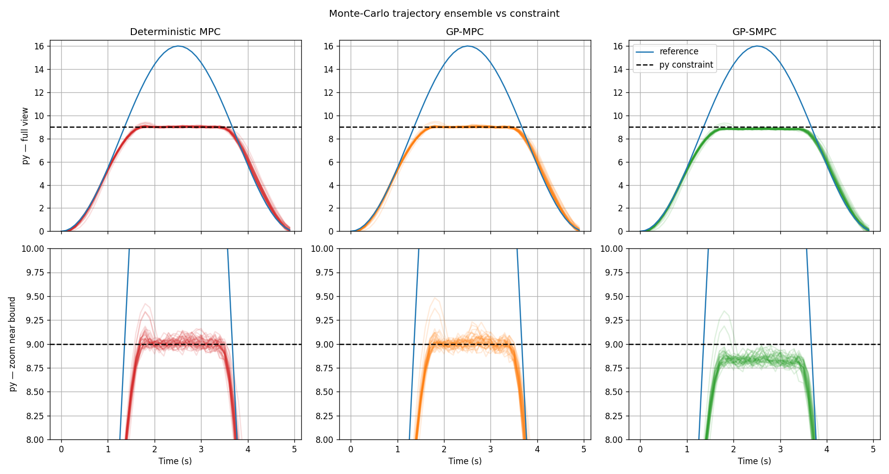
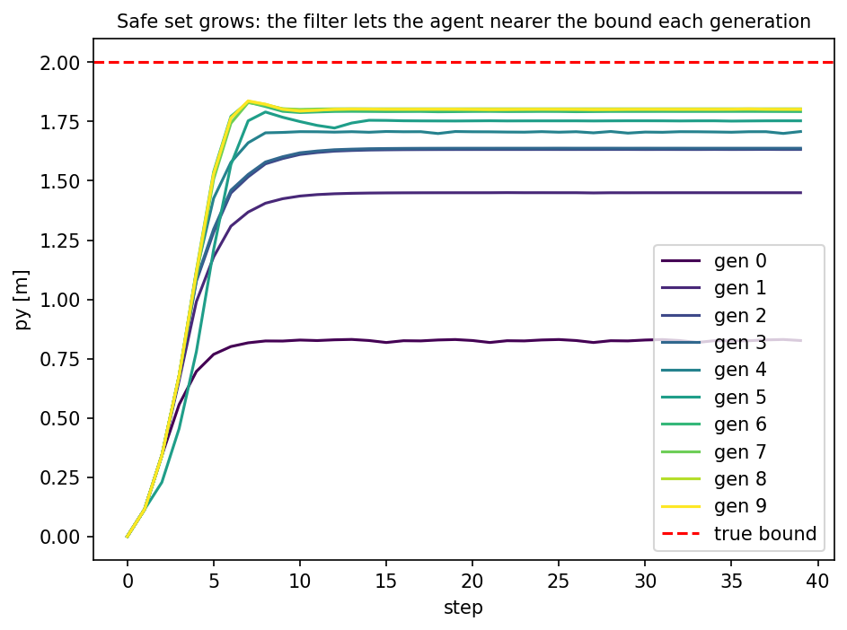

# MPC Framework

A generic Model Predictive Control (MPC) framework in C++17 that bridges classical Stochastic MPC with handling data-driven uncertainty.

## Motivation

Classical MPC assumes a known, exact model. Real systems have unmodeled dynamics, parameter uncertainty, and disturbances. The conventional approach to add robustness, by detuning the controller weights, buys safety with conservatism. Performance is given up everywhere, even where the model is accurate.

This project takes another approach. A Gaussian Process learns the model's residual and its own uncertainty, and the controller tightens its constraints in proportion to that uncertainty. Conservatism only where the learned model is not trustworthy, full performance everywhere else.

## Features

**Core MPC**
- Generic `SystemModel` interface - implement once, reuse the controller unchanged
- Linearization-based MPC with Euler discretization at each step
- Quadratic cost: state (Q), input (R), and input-rate (S) weights, and a DARE-computed terminal weight (Qf)
- Input, state, and control-rate constraints
- Kinematic bicycle model as the reference implementation
- Lane-keeping and path-following examples
- Unit tests with Google Test

**Stochastic MPC with learned uncertainty**
- `StochasticSystemModel` - interface for models that provide state-dependent variance
- `GPResidualModel` - a Gaussian Process learning the model's residual and its own uncertainty from data
- `SMPCController` - propagates a closed-loop covariance tube and tightens state constraints via the Cantelli inequality, turning GP variance into chance constraints
- Comparison demo (Deterministic MPC vs GP-MPC vs SMPC) and a Monte-Carlo violation-rate evaluation under disturbance

**Safe reinforcement learning**
- `SafetyFilter` - a predictive safety filter (subclass of `SMPCController`): given an RL action, returns the closest action that keeps the chance constraints feasible, passing safe actions through unchanged
- `mpc_py` - pybind11 bindings exposing the models and the filter to Python
- `LaneKeepingEnv` - a Gymnasium environment (kinematic bicycle + GP-shaped disturbance) with a Soft Actor-Critic (SAC, Stable-Baselines3) setup, trained with the filter in the loop
- GP re-training - the filter collects residuals as it runs, periodically re-fits its GP, and swaps in the improved filter, so the safe region grows as the model learns

## Results

The SMPC controller drives the same system under disturbances, with identical weights and limits and is able to reduce the number of violations. A Gaussian Process MPC is also compared, which considers the learned mean without any variance.

| Controller | Model knowledge | Handles uncertainty | Violations |
|---|---|---|---|
| Deterministic MPC | nominal | no | 18.9% |
| Gaussian Process MPC (GP-MPC) | + learned mean | no | 17.3% |
| Stochastic MPC (SMPC) | + learned variance | yes | 0.35% |

SMPC cuts constraint violations by ~50× and stays well inside its 5% chance-constraint budget (p = 0.95).



The bottom row shows the mechanism: the covariance-tube backoffs the SMPC controller away from the bound, while the deterministic and GP-MPC controllers cross it.

### Safe reinforcement learning

The same constraint handling becomes a safety filter: at each step it returns the action closest to the RL agent's proposal that keeps the SMPC chance constraints feasible. Safe actions pass through untouched, unsafe ones are corrected.

| SAC training run | Violations |
|---|---|
|Unfiltered agent | 69 |
| **Filtered agent** | **3** |

### Safe learning: the safe set grows as the model learns

Closing the loop from safe control to safe learning: the filter retrains its GP on the residuals it collects while running.

Starting from a deliberately uncertain cold-start GP, the filter first boxes the agent into the middle of the safe set. As it learns the residual, its backoff shrinks and the safe region expands towards the true bound with no constraint violations throughout:

| Filter | Effective safe boundary |
|---|---|
| Cold start (gen 0) | 0.83 m |
| Generation 1 | 1.59 m |
| Generation 4 | 1.78 m |
| Learned (plateau) | 1.87 m  (true bound: 2.0 m) |



## Architecture

```
SystemModel (abstract: dynamics, Jacobians, dims)
    ├── BicycleModel (kinematic bicycle model)
    └── StochasticSystemModel (adds variance(x,u) - state-dependent uncertainty)
        └── GPResidualModel (bicycle + GP-learned residual & variance)

MPCController
    ├── takes SystemModel&, MPCConfig, MPCWeights, MPCLimits
    ├── linearizes model at each step → A, B matrices
    ├── builds lifted QP (Sx, Su, Q_bar, R_bar)
    ├── solves via OSQP
    └── SMPCController
        ├── takes a StochasticSystemModel and probability p
        ├── propagates a closed-loop covariance tube along the horizon
        ├── tightens the state bound by Cantelli backoff (chance constraints)
        └── SafetyFilter (RL safety filter: min ||u0 - u_RL||^2)

MPCWeights - Q, R, S cost matrices, Qf terminal cost (DARE)
MPCLimits  - input, state, control-rate bounds
```

To use a different system, implement `SystemModel` (or `StochasticSystemModel` for an uncertainty-aware one) and pass it to `MPCController` / `SMPCController`, no controller code changes needed.

## Dependencies

All dependencies are fetched automatically via CMake `FetchContent`:

| Library | Version | Purpose |
|---|---|---|
| [Eigen](https://eigen.tuxfamily.org) | 3.4.0 | Matrix algebra |
| [OSQP](https://osqp.org) | 1.0.0 | QP solver |
| [osqp-eigen](https://github.com/robotology/osqp-eigen) | 0.11.0 | C++ OSQP wrapper |
| [GoogleTest](https://github.com/google/googletest) | 1.14.0 | Unit testing |
| [nlohmann/json](https://github.com/nlohmann/json) | 3.11.3 | Parse the exported GP parameters |
| [pybind11](https://github.com/pybind/pybind11) | 2.13.6 | Python bindings for the models and safety filter |

Requires: CMake ≥ 3.14, a C++17 compiler.

## Build

```bash
cmake -S . -B build
cmake --build build
mkdir -p data output
```

## Python environment (for GP training, safe learning and plots)

```bash
python3 -m venv .venv
source .venv/bin/activate
pip install numpy pandas scikit-learn matplotlib gymnasium stable-baselines3
```

## Reproduce the results

1. **Train the GP** - generates `data/gp_params.json` and the mean/variance surface plot `output/gp_surfaces.png`:
```bash
python3 scripts/generate_gp_training_data.py
python3 scripts/gp_training_data.py
```

2. **Comparison demo** - Deterministic vs. GP-MPC vs. SMPC under disturbance:
```bash
./build/comparison
python3 scripts/visualize_comparison.py    # -> output/comparison.png
```

3. **Monte-Carlo evaluation** - violation rates and the trajectory ensemble:
```bash
./build/montecarlo
python3 scripts/visualize_mc.py            # -> output/mc_violations.png
python3 scripts/visualize_ensemble.py      # -> output/ensemble.png
```

4. **Safe reinforcement learning** - train SAC with and without the safety filter, then compare violation counts:
```bash
python3 scripts/train_baseline.py      # -> output/baseline_violations.csv
python3 scripts/train_filtered.py      # -> output/filtered_violations.csv
python3 scripts/visualize_training.py  # -> output/training_violations.png
```
The filtered run requires the `mpc_py` bindings, built as part of `cmake --build build`.

5. **Safe learning (growing safe set)** - re-train the filter's GP on data it collects, generation by generation:
```bash
python3 scripts/train_safe_learning.py       # -> output/safe_learning/gp_gen*.json, effective_bounds.csv
python3 scripts/visualize_safe_learning.py   # -> output/safe_learning/safe_learning_trajectories.png
```

## Other examples
Basic single-controller tracking:
```bash
./build/lane_keeping
python3 scripts/visualize_trajectory.py
```
```bash
./build/path_following
python3 scripts/visualize_trajectory.py
```

## Tests
```bash
./build/tests
```


## Project structure

```
include/
    SystemModel.hpp             # abstract interface
    StochasticSystemModel.hpp   # + variance(x,u)
    models/
        BicycleModel.hpp
        GPResidualModel.hpp     # GP-learned residual + uncertainty
    mpc/
        MPCController.hpp
        SMPCController.hpp      # covariance tube + Cantelli tightening
        SafetyFilter.hpp        # RL safety filter
src/
    models/
        BicycleModel.cpp
        GPResidualModel.cpp
    mpc/
        MPCController.cpp
        SMPCController.cpp
        SafetyFilter.cpp
examples/
    lane_keeping/main.cpp
    path_following/main.cpp
    comparison/main.cpp         # Deterministic vs GP-MPC vs SMPC
    montecarlo/main.cpp         # violation-rate evaluation
    safety_filter/main.cpp      # filtered vs. unfiltered agent
tests/
    BicycleModelTest.cpp
    MPCControllerTest.cpp
    GPResidualModelTest.cpp
    SMPCControllerTest.cpp
    SafetyFilterTest.cpp
scripts/
    generate_gp_training_data.py
    gp_training_data.py         # trains GP, exports data/gp_params.json
    gp_retrain.py               # bins collected data, re-fits the GP per generation
    train_baseline.py           # SAC without the safety filter
    train_filtered.py           # SAC with the filter in the loop
    train_safe_learning.py      # the safe-learning loop (cold start -> grows the safe set)
    visualize_trajectory.py
    visualize_comparison.py
    visualize_mc.py
    visualize_ensemble.py
    visualize_training.py
    visualize_safe_learning.py
python/
    bindings/mpc_py.cpp         # pybind11 module
    envs/
        lane_keeping_env.py     # Gymnasium env (bicycle + GP disturbance)
        filtered_env.py         # wraps the SafetyFilter around the agent
        gp_sigma.py             # numpy GP variance (mirrors GPResidualModel)
    tests/
        test_bindings.py
        test_lane_keeping_env.py
```

## Limitations and future work

**Current Limitations**
- **Unimodal uncertainty:** The Cantelli-based tightening assumes uncertainty that is well described by mean and variance. Multimodal predictions (e.g., "turns left *or* right") would require scenario-based or branch MPC.
- **Full state feedback:** The controller trusts the measured state `x0` exactly. Uncertainty in the state estimate itself (output-feedback SMPC) is not handled.

**Future work: from a safe controller to safe learning**
- **Growing the safe set through GP re-training.** Lane-keeping is a deliberately simple, ground-truth-known task. The next step is a setting where the RL is non-trivial *and* safety is essential.
- **Learned trajectory prediction of other agents.** A neural network predicts surrounding vehicles' trajectories with per-step variance that grows along the horizon; the SMPC turns it into time-varying, uncertainty-proportional distance constraints.
- **ML planners with uncertainty-aware tracking.** A learned planner proposes (possibly aggressive) reference trajectories; the controller follows them only as far as its model confidence reaches.
- **Other system models:** extend beyond the kinematic bicycle model.
